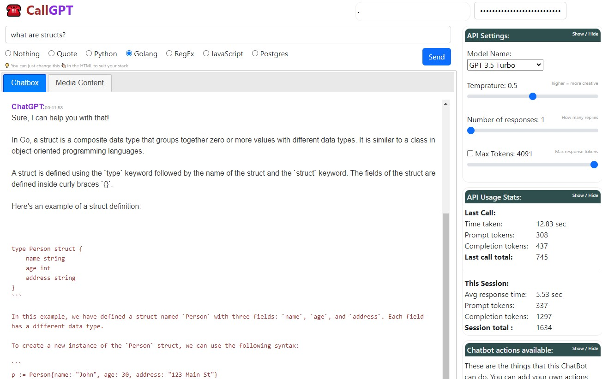
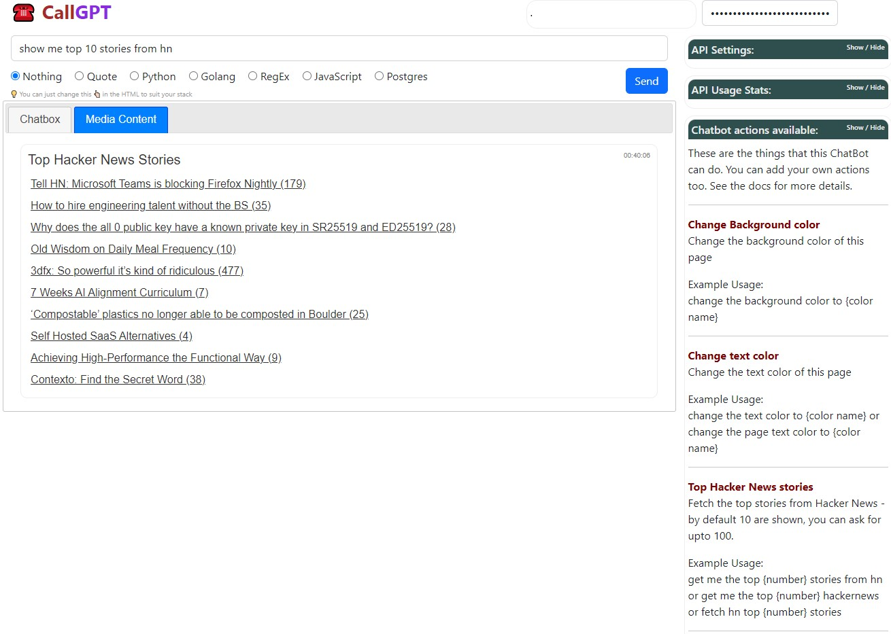
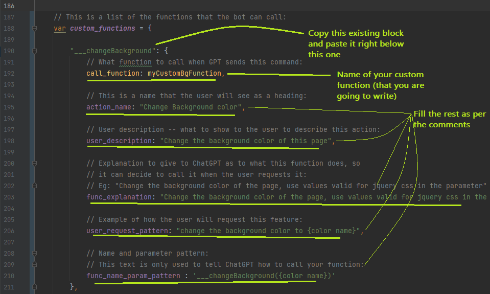
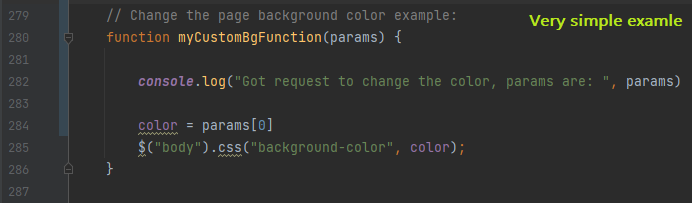
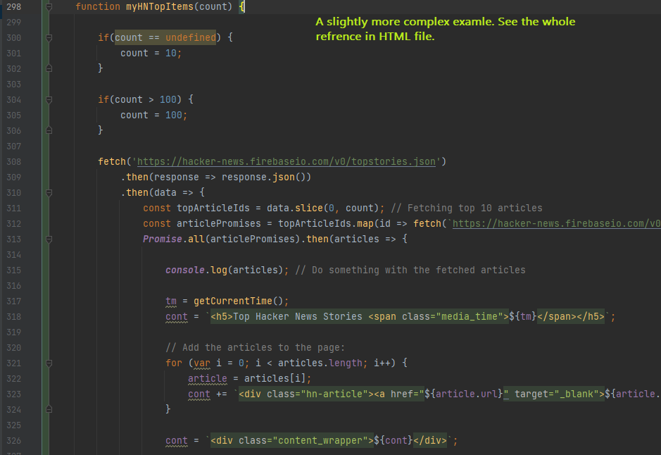
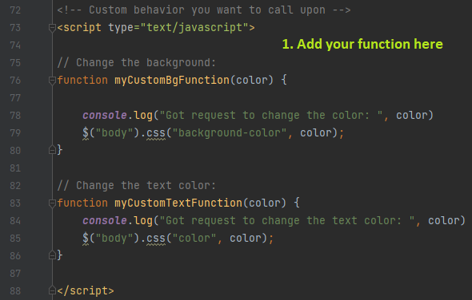
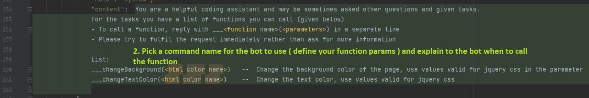
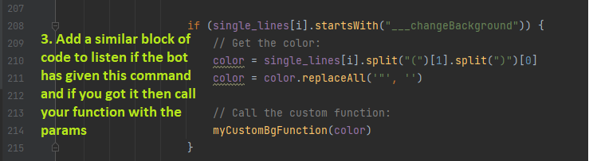
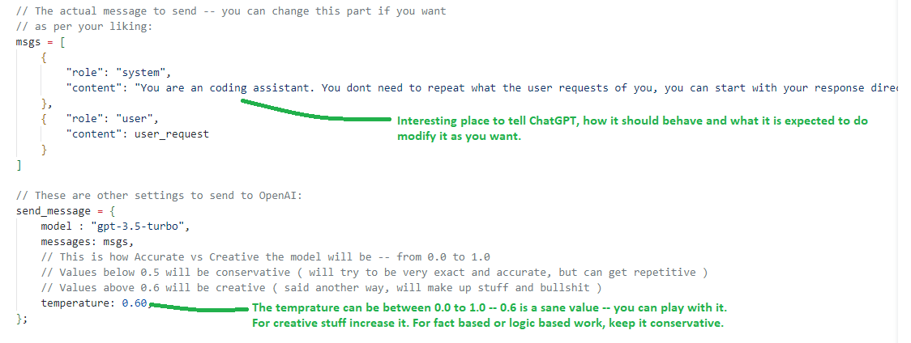

# ☎ CallGPT
A dead simple way to call the ChatGPT API from your machine

Try the client directly --> https://dmingod.github.io/CallGPT/chat_gpt.html

## 👀 What is this?

This is a dead simple way to have a ChatGPT client that you have control over and that you can actually use without having to go to any website

- Its just 1 html that you can save on your desktop or anywhere else and have an interface where you can interact with ChatGPT.

- Except for loading jQuery and Bootstap from a CDN -- there are no services involved. You can download these 2 libraries on your local and work with that if you prefer.

- There are no 3rd party services called  -- the calls are made from your machine to OpenAI.

- The functinality is intentionally kept at a bare-minimum so you can tweak it to your liking.

- You will need to use an API key from OpenAI. The API is fairly cheap, but nevertheless a paid service.

 

## Show me the goods:

**Chat and responses:**

**Custom actions executed by the bot:**

## 🤔 How to use:

1. Download this repo and save the HTML file on any location on your PC.

2. Double-click and run it using chrome.

3. Get an API key from OpenAI for ChatGPT ( from their website )

4. Put your API Key in the field in the top corner and make the calls.

5. Modify the HTML file as you like.

6. Enjoy! 🙂

## ⭐🤖🏃 Custom assistant:

You can add your own custom actions to this bot very easily -- there are 3 examples of doing this in the code.

You only need to do these 2 steps:
1. Define the details of your custom action -- What function should be called, what is the name of the action etc.
2. Write your custom function -- This is the function that will do the work.

#### 1. Define the details of your custom action:

Make sure the key name (`___changeBackground` in this example) is the same as the `func_name_param_pattern` in the `custom_functions` dictionary.

 

#### 2. Write your custom function:

There are 3 examples of custom code examples shown of how you can have the bot execute some functions for you.

1. Change the background color of the page --> you can say "change background to red" and the background will change to red.
2. Change the text to white and it will change the text to white.
3. Fetch the top X stories from Hacker News and show it in the media tab.

- A very simple example that changes the background color of the page:  
  

- A slightly more complex example that fetches the top X stories from Hacker News and shows it in the media tab:  
   

<video src='https://raw.githubusercontent.com/dminGod/CallGPT/main/callGPT.mov' />

To add more capabilities to the Bot:
- Write a new function that does what you want.
- In the bot initialization there is a list of commands that the bot can execute, the parameters it takes and when the function is called -- add your function to this list.
- There is a part of the response message parsing where we check if there are any commands sent by the bot for us to execute -- here we make the call to the function we made.

You can add stuff like calling the HackerNews API and showing it on the screen somewhere or call some local API to 
control the lights or toaster or whatever you want.

## 📝💪🏼 Write your own features:

1. Define the function that will do the work. For example:
  

2. Add a keyword that the bot can use to call this function

  

3. When you get a reply from the bot, see if any of your keywords is called, if yes, call your function:

  

## Tweak it to your liking:

