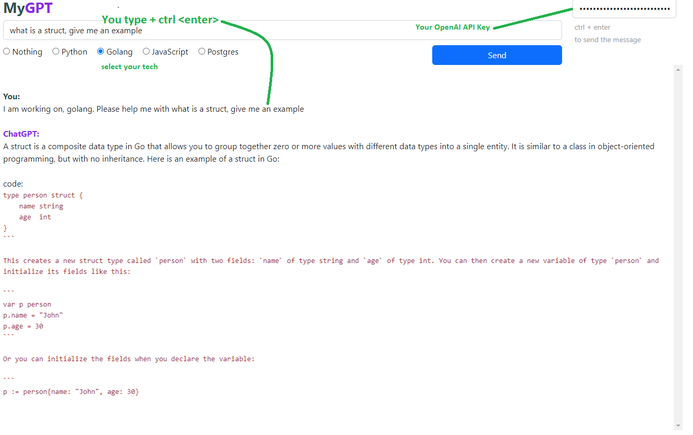
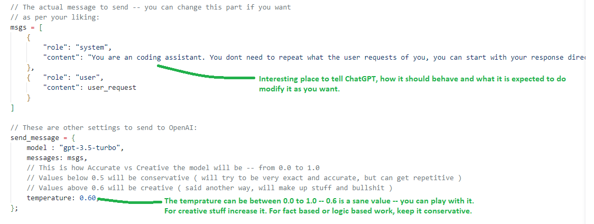

# CallGPT
A dead simple way to call the ChatGPT API from your machine

## What is this?

This is a dead simple way to have a ChatGPT client that you have control over and that you can actually use without having to go to any website

- Its just 1 html ~300 lines HTML file that you can save on your desktop or anywhere else and have an interface where you can interact with ChatGPT.

- Except for loading jQuery and Bootstap from a CDN -- there are no services involved. You can download these 2 libraries on your local and work with that if you prefer.

- There are no 3rd party services called  -- the calls are made from your machine to OpenAI.

- The functinality is intentionally kept at a bare-minimum so you can tweak it to your liking.

- You will need to use an API key from OpenAI. The API is fairly cheap, but nevertheless a paid service.

 

## How to use:

1. Download this repo and save the HTML file on any location on your PC.

2. Double-click and run it using chrome.

3. Get an API key from OpenAI for ChatGPT ( from their website )

4. Put your API Key in the field in the top corner and make the calls.

5. Modify the HTML file as you like.

6. Enjoy! 🙂

## Tweak it to your liking:

